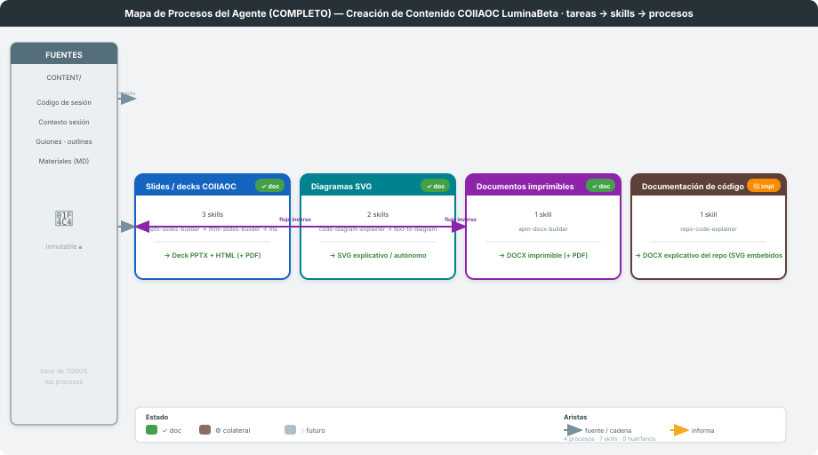
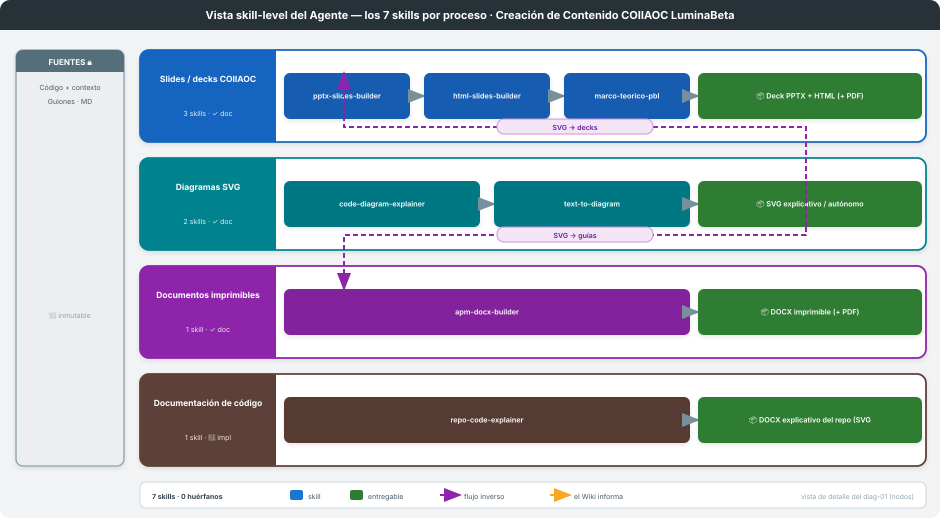

---
# ─────────────────────────────────────────────────────────────────────────────
# DOCUMENTO MAESTRO del mapa de procesos. Su frontmatter declara los procesos
# FUTUROS (reconocidos pero sin carpeta ni skill todavía). Los procesos REALES
# se descubren leyendo el frontmatter de cada docs/proceso-*/PROCESO.md.
# La CONFIG del agente (título, fuentes, meta-skills) vive en `mapa.yaml`.
# ─────────────────────────────────────────────────────────────────────────────
mapa: coiiaoc-contenido
actualizado: 2026-06-08
futuros: []                      # ningún proceso reconocido-sin-skill todavía;
                                 # los 4 del catálogo §2 tienen skills y PROCESO.md
---

# Mapa de Procesos del Agente — Creación de Contenido COIIAOC LuminaBeta

**Arquitectura:** Down-Top — `tareas → skills → procesos`
**Última actualización:** 2026-06-08

> Documento maestro de **nivel superior**: cataloga los **procesos** del agente y cómo se
> relacionan. No describe cada proceso por dentro (eso vive en su `docs/proceso-<slug>/PROCESO.md`);
> aquí se traza el **mapa** que los conecta.
>
> Catálogo derivado del análisis de `.claude/skills/README.md` (3 familias) + `proceso-codigo`
> (documentación de código). Cada proceso tiene `PROCESO.md` (`build-single-process`) y los dos SVG
> de este mapa los regenera `mapa-procesos-agente` (`engine/gen_mapa.py`). Lint actual:
> **4 procesos · 7 skills · 0 huérfanos**.
>
> **Límite del mapa.** Este es la **vista estructural** y cubre los **procesos locales de generación**
> (skills instalados en `.claude/skills/`). **No** modela: (a) los skills **editoriales globales**
> (`lesson-from-source`, `authorship-validator`, `voice-refiner`, `atlas-slop-ai`, en `~/.claude/skills/`),
> ni (b) el **eje metodológico** (Akademos multi-agente / producción directa). Esa casuística operativa
> vive en [`.claude/skills/USE-CASES.md`](../../.claude/skills/USE-CASES.md) y `README.md`.

---

## 1. Visión general

---

## 2. Catálogo de procesos

Las 3 primeras familias derivan de `.claude/skills/README.md`; `proceso-codigo` formaliza el pipeline
de documentación de código. Cada proceso tiene su `PROCESO.md` + serie SVG (`build-single-process`).

| # | Proceso | Slug / carpeta | Skills (en orden) | Entregable | Estado |
|---|---------|----------------|-------------------|------------|--------|
| 1 | Slides / decks | [`proceso-slides`](../proceso-slides/PROCESO.md) | `pptx-slides-builder` · `html-slides-builder` · `marco-teorico-pbl` | PPTX · HTML · PDF | ✓ documentado |
| 2 | Diagramas | [`proceso-diagramas`](../proceso-diagramas/PROCESO.md) | `code-diagram-explainer` · `text-to-diagram` | SVG | ✓ documentado |
| 3 | Documentos | [`proceso-documentos`](../proceso-documentos/PROCESO.md) | `apm-docx-builder` (+ globales `pdf-export` · `word-template-gen`) | DOCX · PDF | ✓ documentado |
| 4 | Documentación de código | [`proceso-codigo`](../proceso-codigo/PROCESO.md) | `repo-code-explainer` (compone diagramas + documentos) | DOCX (SVG embebidos) | 🔨 implementado |

> `html2pptx` está **ARCHIVADO** (no usar) → excluido del catálogo. Los skills globales
> (`pdf-export`, `word-template-gen`) viven en `~/.claude/skills/`, no en este repo.

---

## 3. Relaciones entre procesos

*(Fuente común, encadenamientos `alimenta`, `informa`, `precede`. El texto se concilia a mano;
los SVG los regenera `mapa-procesos-agente`.)*

- **Fuente común:** las 3 familias parten de la misma capa de fuentes (`CONTENT/`: código de
  sesión + contexto + guiones/outlines), declarada en `mapa.yaml`.
- **Diagramas → Slides / Documentos** (`alimenta`): los SVG de `proceso-diagramas` se incrustan
  en decks (`proceso-slides`) y en guías/documentos (`proceso-documentos`).
- **Código → Diagramas / Documentos** (`informa`): `proceso-codigo` **compone** la gramática SVG de
  `proceso-diagramas` y la infraestructura DOCX de `proceso-documentos` (las reutiliza, no las duplica).
- Relaciones tipadas declaradas en el frontmatter `relaciones:` de cada proceso origen.

---

## 4. Inventario de skills por proceso

| Skill | Proceso | Rol |
|---|---|---|
| `pptx-slides-builder` | Slides | guión JSON → PPTX **y** HTML (fuente única) |
| `html-slides-builder` | Slides | design system HTML + respaldo `html_to_pptx.py` |
| `marco-teorico-pbl` | Slides | 4 slides de marco teórico PBL (A–D) |
| `code-diagram-explainer` | Diagramas | código → SVG explicativo |
| `text-to-diagram` | Diagramas | texto/conceptos → SVG autónomo |
| `apm-docx-builder` | Documentos | material de curso → DOCX |
| `repo-code-explainer` | Documentación de código | repo → SVG por unidad → PNG → DOCX |

**Invariante:** sin skills huérfanos — cada skill de dominio cae en un proceso. Excepciones:
`html2pptx` (archivado), skills globales de usuario y los `meta_skills` del kit.

---

## 5. Mantenimiento (flujo único anti-drift)

Cuando cambia un skill o un proceso, seguir **un solo camino** para que las tres vistas (estructural ·
operativa · visual) no diverjan:

1. Actualizar el `SKILL.md` del skill **y** el `frontmatter` de su `docs/proceso-<slug>/PROCESO.md`.
2. `python .claude/skills/mapa-procesos-agente/engine/gen_mapa.py` → regenera los SVG + corre el lint
   («sin huérfanos»). **Lint en verde** es condición para dar el cambio por bueno.
3. Conciliar las **vistas operativas** a mano: tablas de `.claude/skills/README.md` y `USE-CASES.md`
   (+ la hoja de `_content-creation-map/` que aplique). Candidato a automatizar con `repo-reconciler`.

El **frontmatter** es la fuente de verdad estructural; los SVG y las tablas son **derivados**.

---

*Diagramas en `svg/` (generados por `mapa-procesos-agente`). Config del agente en `mapa.yaml`.
Procesos individuales en `docs/proceso-<slug>/PROCESO.md`.*
