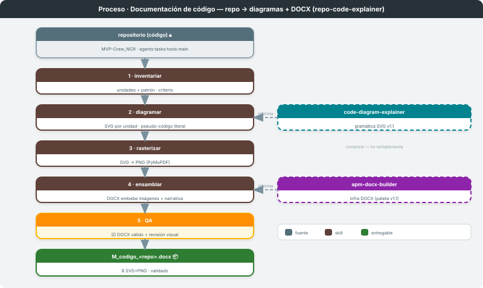
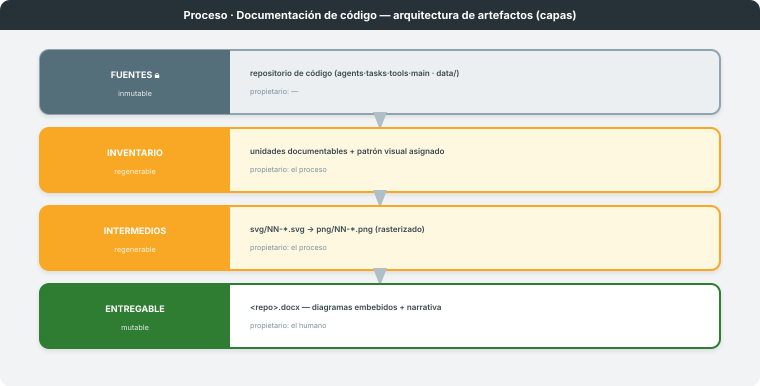

# Documentación de código

**Dominio:** cualquier repositorio de código (caso de validación: `MVP-Crew_NCR`) · **Skill:** `repo-code-explainer`
**Entregable:** DOCX que explica el repo con un diagrama por unidad · **Última actualización:** 2026-06-08

> Transforma un **repositorio de código** en un paquete didáctico: una serie de diagramas SVG (uno por
> unidad) + un **DOCX** que los embebe con narrativa "por qué". No reimplementa nada: **compone** la
> gramática visual de `proceso-diagramas` y la infraestructura DOCX de `proceso-documentos`.
>
> **Estado: implementado (prototipo, 2026-06-08).** Diseño y decisiones abiertas en
> [`PROPUESTA.md`](PROPUESTA.md). Validado sobre `MVP-Crew_NCR` (8 unidades).

---

## 1. Visión general

Proceso de **un solo skill (`repo-code-explainer`) con pipeline interno + bucle por unidad**. Parte de
un repositorio inmutable, inventaría sus unidades documentables, dibuja una por una con la gramática
COIIAOC v1.1, las rasteriza y las ensambla en un DOCX. La frontera criterio↔determinismo es interna:
*inventariar* y *diagramar* son criterio (leer el código, elegir patrón, pseudo-código literal);
*rasterizar* y *ensamblar* son deterministas. Dos puertas humanas: el inventario y la firma del DOCX.

---

## 2. Arquitectura de artefactos

| Capa | Mutabilidad | Propietario | Qué contiene |
|---|---|---|---|
| **Fuentes** 🔒 | inmutable | — | el repositorio de código (`MVP-Crew_NCR`: `agents.py` · `tasks.py` · `tools.py` · `main.py` · `data/`) |
| **Inventario** | regenerable | el proceso | unidades documentables + patrón visual asignado (criterio) |
| **Intermedios** | regenerable | el proceso | `svg/NN-<unidad>.svg` → `png/NN-<unidad>.png` (rasterizado) |
| **Entregable** | mutable | el humano | `<repo>.docx` — un diagrama embebido por unidad + narrativa |

Acoplamiento por fichero en toda la cadena: **código → inventario → SVG → PNG → DOCX**. Nunca se
escribe dentro del repo fuente (puede ser un git anidado / submódulo): la salida va a una carpeta de
materiales **fuera** del repo.

---

## 3. Etapa 1 — Inventariar *(criterio)*

- **Qué hace:** lee el repo y lista las **unidades documentables** (clase, función, agente, task, tool,
  modelo), asignando a cada una el patrón de `code-diagram-explainer` (checks · ensamblaje · config
  declarativa · bifurcación · bucle).
- **Contrato de E/S:** recibe la ruta del repo → emite un inventario ordenado. **Puerta humana #1.**

## 4. Etapa 2 — Diagramar *(criterio)*

- **Qué hace:** por unidad, lee el **código real** (nunca de memoria) y produce el SVG con pseudo-código
  **literal**, ramas ✓/✗, badges y leyenda. **Reutiliza la gramática de `proceso-diagramas`.**
- **Contrato de E/S:** unidad de código → `svg/NN-<unidad>.svg`.

## 5. Etapa 3 — Rasterizar *(determinista)*

- **Qué hace:** `svg/*.svg` → `png/*.png` con PyMuPDF (`fitz`) a DPI ~150 (Word no garantiza render SVG).
- **Contrato de E/S:** SVG → PNG.

## 6. Etapa 4 — Ensamblar *(determinista)*

- **Qué hace:** DOCX con portada + una sección por unidad (título + 2–4 líneas de prosa "por qué" +
  imagen embebida). **Reutiliza la infraestructura DOCX de `proceso-documentos`.**
- **Contrato de E/S:** PNG + narrativa → `<repo>.docx`. Validación ZIP / XML.

## 7. Puerta humana — QA *(humano + determinista)*

- **Forma:** DOCX válido + revisión visual de cada diagrama (sin overflow, pseudo-código legible).
  **Posición:** al final, antes de entregar. **Puerta humana #2** (firma). Máx. 2 ciclos.

---

## 8. Invariante / ciclo de vida

**Parte siempre del código real** (nunca de memoria); pseudo-código **literal**; un diagrama por
unidad; acoplamiento **por fichero** (SVG→PNG→DOCX). Un repo recorre: inventario → diagramas → PNG →
DOCX validado → firma. El proceso **compone**, no duplica: la gramática vive en `proceso-diagramas`
y el motor DOCX en `proceso-documentos`.

## 9. Referencia rápida de triggers

| Skill | Trigger | Acción |
|---|---|---|
| `repo-code-explainer` | "documenta el código de este repo", "diagramas + DOCX del codebase", "explica el código de `<repo>` en un Word" | repo → SVG por unidad → PNG → DOCX |

## 10. Limitaciones conocidas y decisiones de diseño

| Aspecto | Decisión | Razón |
|---|---|---|
| Inventario | AST genérico (`inventory.py`) + cross-check con `inventario.json` — auto-stub de unidades core sin curar | ✅ Phase-2 completada |
| Embebido DOCX | par **PNG+SVG** (`python-docx` + OOXML `attach_svg`) — 16 media / 8 `svgBlip` / `Content_Types svg` verificados | ✅ Phase-2 completada |
| `docx-apm-utils.js` | alias de `_shared/docx-core.js` (motor curso-neutro) — compatibilidad mantenida | ✅ Phase-2 completada |
| Gramática SVG | modo-fichero unificado: `code-diagram-explainer/svg_grammar.py` importado por `gen_repo_diagrams.py` — salida byte-idéntica verificada | ✅ Phase-2 completada |
| Relaciones `informa` | a `diagramas` y `documentos` | comparte gramática/infra; el engine no las dibuja (solo informa desde `fundacional`), pero quedan en el catálogo |

---

*Diagramas en `svg/`. Diseño y casuística en [`PROPUESTA.md`](PROPUESTA.md). Salida del prototipo:
`CONTENT/PARTE2-coiiaoc-Materiales/II-CrewIA/M_codigo-crew_NCR/`. Mapa global en
[`../MATERIALES-PROCESOS/`](../MATERIALES-PROCESOS/PROCESO.md). Procesos análogos/compuestos: [`../proceso-diagramas/`](../proceso-diagramas/PROCESO.md), [`../proceso-documentos/`](../proceso-documentos/PROCESO.md).*
