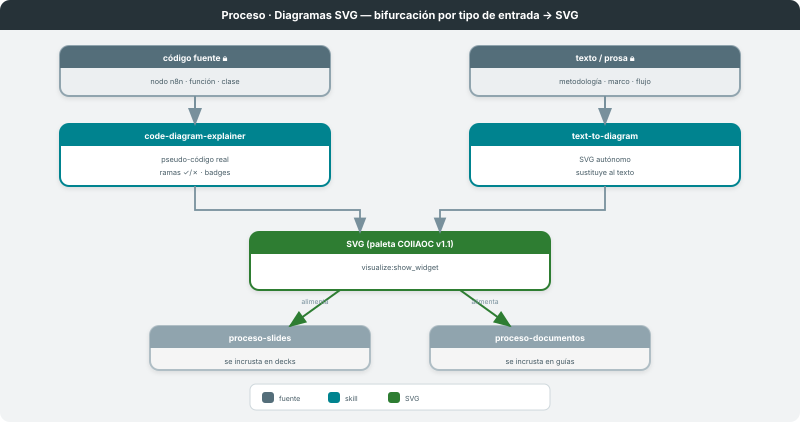
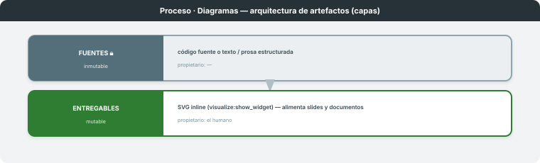

# Diagramas SVG

**Dominio:** COIIAOC (material docente) · **Skills:** `code-diagram-explainer` ∥ `text-to-diagram`
**Entregable:** SVG que explica código o sustituye texto · **Última actualización:** 2026-06-08

> Transforma una **entrada** (código fuente **o** texto estructurado) en un **SVG** con la paleta
> COIIAOC v1.1. El SVG no decora: explica o sustituye. Su salida **alimenta** los otros dos procesos
> —se incrusta en decks (`proceso-slides`) y en guías/documentos (`proceso-documentos`).

---

## 1. Visión general

Proceso de **bifurcación por tipo de entrada**: dos skills hermanos, cada uno una ruta de un solo
paso, que convergen en el mismo entregable (un SVG con la gramática visual del curso). La puerta
humana es **difusa**: el SVG se revisa visualmente y se inserta donde corresponde. La frontera entre
los dos skills es el **origen del dibujo**: `code-diagram-explainer` parte de código real;
`text-to-diagram` parte de prosa estructurada.

---

## 2. Arquitectura de artefactos

| Capa | Mutabilidad | Propietario | Qué contiene |
|---|---|---|---|
| **Fuentes** 🔒 | inmutable | — | código fuente (nodo n8n, función, clase) **o** texto/prosa (metodología, marco, flujo) |
| **Entregables** | mutable | el humano | el SVG — inline vía `visualize:show_widget`, incrustado en slide/guía |

No hay capa intermedia persistida: el SVG es el entregable y a la vez el artefacto que **alimenta**
otros procesos. El acoplamiento aguas abajo es por fichero (el SVG incrustado).

---

## 3. Ruta A — Código → SVG (`code-diagram-explainer`)

- **Qué hace:** diagrama explicativo de un fragmento de código: pseudo-código **real** (no paráfrasis),
  flujo de control con ramas ✓/✗, badges de acción, anotaciones didácticas.
- **Skill / trigger:** `code-diagram-explainer` · "explica este nodo", "diagrama del nodo",
  "esquema visual del código".
- **Contrato de E/S:** recibe código fuente (extraído del JSON del workflow o del archivo) → emite SVG
  `viewBox="0 0 680 H"` vía `visualize:show_widget`.
- **Patrones canónicos:** checks secuenciales · ensamblaje · configuración declarativa · bifurcación
  única · bucle. Cada bloque puede llevar `onclick="sendPrompt(...)"` con una pregunta de "por qué".

## 4. Ruta B — Texto → SVG (`text-to-diagram`)

- **Qué hace:** convierte una sección de prosa estructurada (metodología, arquitectura, marco) en un
  SVG **autónomo** que se lee sin el texto original.
- **Skill / trigger:** `text-to-diagram` · "convierte esto en diagrama", "ilustra la metodología/el
  flujo", "sustituye el texto con un diagrama".
- **Contrato de E/S:** recibe texto/prosa → emite SVG `viewBox="0 0 680 H"` vía `visualize:show_widget`.
- **Layouts:** pipeline vertical · ciclo cerrado (PDCA) · arquitectura de capas · comparación
  antes/después. Regla de 2–3 colores por diagrama + leyenda obligatoria.

---

## 5. Invariante / ciclo de vida

**Nunca dibujar desde memoria.** Ambas rutas parten siempre del **origen real** —el código fuente o
el texto literal— y usan las palabras/expresiones exactas (pseudo-código literal, labels textuales).
El diagrama opera en el nivel del artefacto; la prosa que lo acompaña en el chat opera en el nivel de
abstracción superior (el "por qué") y nunca repite lo que el SVG ya muestra.

## 6. Referencia rápida de triggers

| Skill | Trigger | Acción |
|---|---|---|
| `code-diagram-explainer` | "explica este nodo", "diagrama del nodo", "explica visualmente" | código → SVG explicativo |
| `text-to-diagram` | "convierte en diagrama", "ilustra la metodología", "hazlo visual" | texto → SVG autónomo |

## 7. Limitaciones conocidas y decisiones de diseño

| Aspecto | Decisión | Razón |
|---|---|---|
| Solapamiento de skills | frontera por **origen** (código vs texto) | misma gramática visual, distinto material de partida |
| `visualize:show_widget` | siempre, nunca `.svg` standalone | objeto de aprendizaje interactivo (`sendPrompt`) |
| Fuentes Google en SVG | fallback `sans-serif`, sin `@import` | el render del widget puede no tener Syne/IBM Plex |
| Cardinalidad | >7–8 nodos → dividir en dos diagramas | legibilidad |

---

*Diagramas en `svg/`. Mapa global en [`../MATERIALES-PROCESOS/`](../MATERIALES-PROCESOS/PROCESO.md). Procesos análogos:
[`../proceso-slides/`](../proceso-slides/PROCESO.md), [`../proceso-documentos/`](../proceso-documentos/PROCESO.md).*
