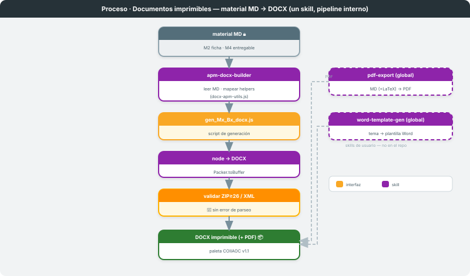
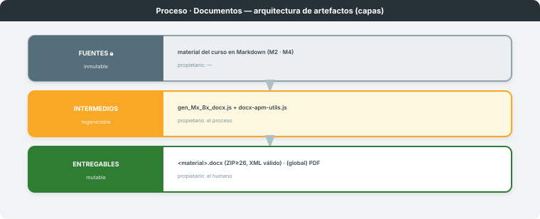

# Documentos imprimibles

**Dominio:** material de curso (APM Terminals 2026 · COIIAOC) · **Skills:** `apm-docx-builder` (+ globales `pdf-export` · `word-template-gen`)
**Entregable:** `.docx` imprimible con paleta v1.1 (+ PDF) · **Última actualización:** 2026-06-08

> Transforma un **material en Markdown** en un documento imprimible. La ruta documentada en el repo
> es `apm-docx-builder` (MD → DOCX); dos skills **globales de usuario** completan la familia para PDF
> y plantillas Word. El humano firma sobre el documento final.

---

## 1. Visión general

Proceso de **un solo skill con pipeline interno** (`apm-docx-builder`): leer MD → mapear a helpers →
escribir un script `gen_Mx_Bx_docx.js` → ejecutar con `node` → validar el ZIP/XML. Las rutas a PDF
(`pdf-export`) y a plantilla Word desde catálogo de temas (`word-template-gen`) son **skills globales
de usuario** (`~/.claude/skills/`), fuera de este repo; se documentan aquí por completitud de la
familia, pero no entran en el contrato máquina (`skills:`) del mapa.

---

## 2. Arquitectura de artefactos

| Capa | Mutabilidad | Propietario | Qué contiene |
|---|---|---|---|
| **Fuentes** 🔒 | inmutable | — | material del curso en Markdown (M2 ficha/plantilla, M4 entregable) |
| **Intermedios** | regenerable | el proceso | `scripts/gen_Mx_Bx_docx.js` + módulo compartido `docx-apm-utils.js` |
| **Entregables** | mutable | el humano | `<material>.docx` (≥26 ficheros en el ZIP, XML válido) · (globales) PDF |

El acoplamiento es por fichero: el script de generación es el artefacto intermedio reproducible; el
DOCX es el entregable que el humano revisa e imprime.

---

## 3. Etapa interna — MD → DOCX (`apm-docx-builder`)

Un único skill orquesta cinco pasos internos (criterio + determinista):

1. **Leer el MD fuente** — entender estructura y contenido. *(criterio)*
2. **Mapear secciones a helpers** de `docx-apm-utils.js`: intro → `callout()`, cabecera →
   `blockHdr()`, tabla label/valor → `labelTable()`, rúbrica → `rubricTable()`, 2 cols →
   `twoColTable()`, separador de versión → `versionDivider()`. *(criterio)*
3. **Escribir el script** `scripts/gen_Mx_Bx_docx.js` usando la fábrica `makeDoc({chip,title,footer,children})`. *(determinista)*
4. **Ejecutar** `node scripts/gen_Mx_Bx_docx.js` → `<material>.docx`. *(determinista)*
5. **Validar** — ZIP con ≥26 ficheros y `document.xml`/`styles.xml`/`numbering.xml` parsean sin error. *(determinista)*

- **Skill / trigger:** `apm-docx-builder` · "versión Word", "DOCX", "documento para imprimir".
- **Contrato de E/S:** recibe material MD → emite `<material>.docx` (paleta COIIAOC v1.1).
- **Reglas críticas:** `ShadingType.CLEAR` (nunca `SOLID`); bullets vía `LevelFormat.BULLET`; tablas
  en `WidthType.DXA` con anchos que sumen exacto; cell margins fijos.

## 4. Rutas globales complementarias (usuario, no en repo)

- **`pdf-export`** — Markdown (+LaTeX) → PDF: Pandoc·KaTeX → HTML → Chrome headless (por defecto) o
  WeasyPrint (PDF con marcadores). Trigger: "exporta a PDF", "genera el PDF".
- **`word-template-gen`** — catálogo de temas → plantilla Word (.docx) + render MD a PDF/Word/HTML
  con el mismo estilo. Trigger: "genera una plantilla Word", "renderiza este md con el tema X".

---

## 5. Invariante / ciclo de vida

**Paleta v1.1 + validación dura.** Todo DOCX se construye con el módulo compartido `docx-apm-utils.js`
(una sola fuente de tokens y helpers) y no se entrega hasta pasar la validación ZIP≥26 / XML. Un
material recorre: MD → script de generación → `node` → DOCX validado → revisión humana → impresión.

## 6. Referencia rápida de triggers

| Skill | Trigger | Acción |
|---|---|---|
| `apm-docx-builder` | "versión Word", "DOCX", "documento para imprimir" | MD → DOCX (paleta v1.1) |
| `pdf-export` (global) | "exporta a PDF", "genera el PDF", "pandoc" | MD (+LaTeX) → PDF |
| `word-template-gen` (global) | "plantilla word", "renderiza con el tema X" | catálogo de temas → plantilla + render |

## 7. Limitaciones conocidas y decisiones de diseño

| Aspecto | Decisión | Razón |
|---|---|---|
| Dominio de `apm-docx-builder` | **otro curso** (APM Terminals 2026) | reutiliza paleta v1.1; conviven en el mismo agente |
| Globales fuera de `skills:` | solo en prosa, no en frontmatter | viven en `~/.claude/skills/`, no instalados en el repo → evita `dangling` en el lint |
| Módulo compartido | un `docx-apm-utils.js` por todos los scripts | tokens y helpers en una sola fuente |
| Guías HTML del curso (M2/M3) | fuera de este proceso | se autoran en HTML e imprimen con `Chrome --print-to-pdf`, sin skill |

---

*Diagramas en `svg/`. Definición de "proceso" y gramática en el kit Process-Oriented Agent
(`process-oriented-agent-kit/`). Mapa global en `docs/AGENTE-PROCESOS/`. Procesos análogos:
`docs/proceso-slides/`, `docs/proceso-diagramas/`.*
