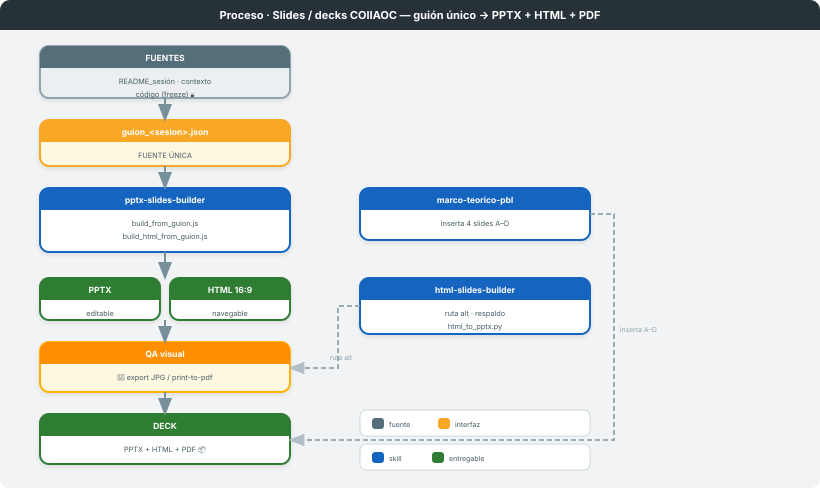
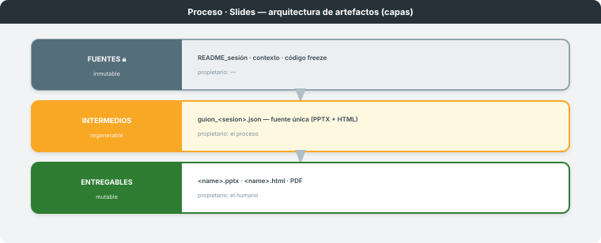

# Slides / decks COIIAOC

**Dominio:** COIIAOC Parte 2 (II1–II6) · **Skills:** `pptx-slides-builder` → `marco-teorico-pbl` · (alt) `html-slides-builder`
**Entregable:** deck de apertura de sesión en PPTX editable + HTML navegable (+ PDF) · **Última actualización:** 2026-06-08

> Transforma un **guión JSON** (la fuente única) en el deck de una sesión del curso. El mismo guión
> produce PPTX y HTML; un segundo skill inserta la capa de marco teórico PBL. El humano firma en el
> **QA visual** antes de entregar.

---

## 1. Visión general

Proceso de **rutas convergentes**, no tubería lineal. La ruta dominante parte de un **guión JSON**
y lo compila a dos formatos en paralelo con `pptx-slides-builder`. Sobre ese deck, `marco-teorico-pbl`
inserta 4 slides A–D de base conceptual. Existe una **ruta alternativa** (`html-slides-builder`) para
decks autorados a mano en HTML, con un conversor de respaldo a PPTX de imágenes. Todas las rutas
convergen en un **QA visual obligatorio** —la puerta humana— antes del entregable.

---

## 2. Arquitectura de artefactos

| Capa | Mutabilidad | Propietario | Qué contiene |
|---|---|---|---|
| **Fuentes** 🔒 | inmutable | — | `README_<sesion>.md`, contexto de sesión, código congelado (FIRST-CODE-THEN-LEARN) |
| **Intermedios** | regenerable | el proceso | `guion_<sesion>.json` — **fuente única**: de él se generan PPTX y HTML |
| **Entregables** | mutable | el humano | `<name>.pptx` (editable) · `<name>.html` (16:9 navegable) · PDF (`--print-to-pdf`) |

El acoplamiento es **por fichero**: el guión JSON es el artefacto de interfaz del que penden ambos
builders. No se autora el HTML a mano ni se convierte HTML→PPTX en la ruta principal — se escribe
**un** guión y se generan los dos formatos.

---

## 3. Etapa 1 — Redacción del guión (fuente única)

- **Qué hace:** estructura la sesión en un `guion_<sesion>.json` (`assets/guion_schema.json`): tipos
  `portada · contenido_cards · flujo · tabla · iore · divider · gate · impacto · cierre · preview_sesion`.
- **Skill / trigger:** `pptx-slides-builder` · "crea la presentación/overview de la sesión".
- **Contrato de E/S:** recibe contexto de sesión (`README_<sesion>.md`) → emite `guion_<sesion>.json`.
- **Convenciones editoriales** (en generación, no como corrección): `IDEA CLAVE` (no `IDEA FUERZA`),
  h1 de 2–4 palabras, copyright solo en slide 1, sin meta-etiquetas. Fuente: sección "Editorial
  conventions" de `html-slides-builder/SKILL.md`.

## 4. Etapa 2 — Compilación PPTX + HTML

- **Qué hace:** dos builders paralelos sobre el **mismo** guión.
  - `node scripts/build_from_guion.js <guion.json>` → `<name>.pptx` (shapes nativos, editable).
  - `node scripts/build_html_from_guion.js <guion.json>` → `<name>.html` (16:9, nav ← →, contador, `@media print`).
- **Skill / trigger:** `pptx-slides-builder`.
- **Contrato de E/S:** recibe `guion_<sesion>.json` → emite `<name>.pptx` **y** `<name>.html` en
  `PPTX_OUT_DIR` o `SAMPLE/`.

## 5. Etapa 3 — Marco teórico PBL (inserción)

- **Qué hace:** genera 4 slides A–D (concepto formal · taxonomía · mecanismo · cierre transferible)
  para **insertar** en el deck existente, convirtiéndolo en Project Based Learning genuino.
- **Skill / trigger:** `marco-teorico-pbl` · "añade el marco teórico", "convierte en PBL".
- **Contrato de E/S:** recibe nº de sesión + fase PRDA + concepto central (o el PPTX) → emite
  `marco_teorico_<sesion>.pptx` (4 slides). Inserción: A tras portada · B/C antes de la idea clave ·
  D tras el gate.

## 6. Etapa alternativa — HTML autorado + respaldo

- **Qué hace:** design system (tokens, tipografía, patrones A–E) para decks HTML autorados a mano.
  Incluye `scripts/html_to_pptx.py` como **respaldo** (HTML terminado → PPTX de imágenes, no editable).
- **Skill / trigger:** `html-slides-builder` · "produce slides", "arranca M1" (cuando se autora HTML
  directamente, no desde guión).
- **Fuente de verdad:** `html-slides-builder/assets/paleta_curso.html` v1.1.

## 7. Puerta humana — QA visual (obligatorio)

- **Forma:** el humano revisa cada slide tras la generación. **Posición:** al final, antes de entregar.
- **PPTX:** export a JPG vía PowerPoint COM. **HTML:** Chrome `--headless --print-to-pdf` → PyMuPDF → `Read`.
- Defectos vigilados: overflow de h1 (>50 chars), solapamiento en footer (y=5.3), contraste prohibido
  (naranja oscuro `C2510A` sobre azul `1E3A5F`), cards fuera de margen. Máx. 2 ciclos de corrección.

---

## 8. Invariante / ciclo de vida

**El guión JSON es la fuente única.** PPTX y HTML salen del mismo fichero: nunca se editan en
paralelo ni se convierte uno en otro. Una sesión recorre: contexto → guión → (PPTX ∥ HTML) →
+marco PBL → QA visual → entrega. El deck no se produce hasta que el código de la sesión pasa su
checkpoint de freeze (gobernanza FIRST-CODE-THEN-LEARN).

## 9. Referencia rápida de triggers

| Skill | Trigger | Acción |
|---|---|---|
| `pptx-slides-builder` | "crea la presentación/overview", VERBEX/PRDA/IORE | guión → PPTX + HTML |
| `marco-teorico-pbl` | "añade el marco teórico", "convierte en PBL", "slide A a D" | 4 slides A–D insertables |
| `html-slides-builder` | "produce slides", "arranca M1" (HTML directo) | design system + respaldo `html_to_pptx.py` |

## 10. Limitaciones conocidas y decisiones de diseño

| Aspecto | Decisión | Razón |
|---|---|---|
| `html2pptx` | **ARCHIVADO**, fuera del proceso | scripts rotos en Windows (paths Linux, `pdftoppm`/LibreOffice ausentes) |
| Doble formato | un guión → dos builders | evitar divergencia PPTX/HTML; fuente única auditable |
| QA visual | obligatorio, máx 2 ciclos | overflow de h1 y contraste son los defectos recurrentes |
| `marco-teorico-pbl` | re-save con python-pptx | PptxGenJS 4.x viola orden OOXML; PowerPoint rechaza sin el re-save |

---

*Diagramas en `svg/`. Mapa global en [`../MATERIALES-PROCESOS/`](../MATERIALES-PROCESOS/PROCESO.md). Procesos análogos:
[`../proceso-diagramas/`](../proceso-diagramas/PROCESO.md), [`../proceso-documentos/`](../proceso-documentos/PROCESO.md).*
