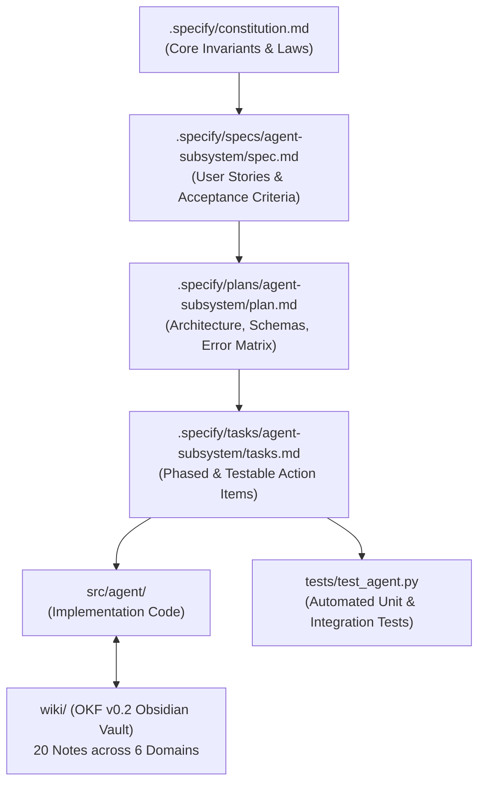
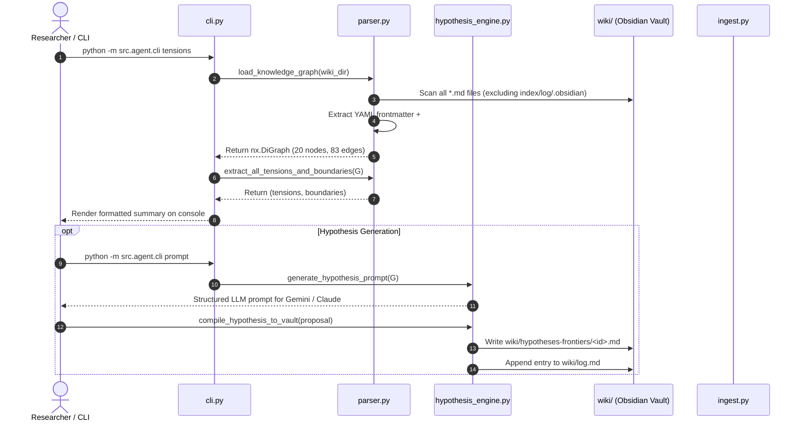
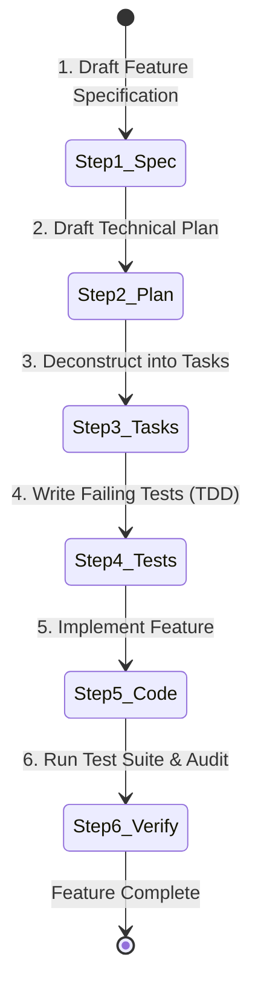

# The Complete Spec-Driven Development (SDD) & `src/agent` Manual

**A Self-Contained Guide to GitHub Spec Kit, OKF v0.2 Knowledge Vaults, and the Research Agent**

---

## 1. Executive Summary & Philosophy

### 1.1 What is Spec-Driven Development (SDD)?

In traditional software development, code is often written directly from informal prompts or loose notes. In complex, research-grade systems—such as **Explainable Relational Graph Neural Networks (xGNN)** and **Open Knowledge Format (OKF v0.2)** knowledge repositories—this leads to architectural drift, unverified assertions, broken links, and target leakage.

**Spec-Driven Development (SDD)** with **GitHub Spec Kit** (`specify`) inverts this workflow:

1. **The Constitution** (`.specify/constitution.md`) defines the non-negotiable laws and invariant boundaries of the repository.
2. **The Specification** (`.specify/specs/.../spec.md`) defines **WHAT** the system must do from the perspective of user stories and acceptance criteria, without tying it to implementation details.
3. **The Technical Plan** (`.specify/plans/.../plan.md`) defines **HOW** the architecture, data schemas, module boundaries, and error recovery strategies fulfill the specification.
4. **The Task Breakdown** (`.specify/tasks/.../tasks.md`) defines **WHEN & IN WHAT ORDER** modular, testable units of work are implemented and verified.
5. **The Code** (`src/`) and **Tests** (`tests/`) are the physical execution of the tasks.



---

## 2. The SDD Artifact Matrix in this Repository

| SDD Artifact                        | Exact Path                                                                                                                                                                                                                                                       | Role & Purpose                                                                                                                                                                                                                                                                                                                            |
| :---------------------------------- | :--------------------------------------------------------------------------------------------------------------------------------------------------------------------------------------------------------------------------------------------------------------- | :---------------------------------------------------------------------------------------------------------------------------------------------------------------------------------------------------------------------------------------------------------------------------------------------------------------------------------------- |
| **Repository Constitution**   | [`.specify/constitution.md`](file:///c:/Users/brjap\Documents/__CODE_gpu/_2027-xGNN-obsidian-llm-wiki/.specify/constitution.md)                                                                                                                                 | **The 5 Unbreakable Laws**: OKF v0.2 conformity, strict 3-layer immutability (`sources/` $\to$ `raw/` $\to$ `wiki/`), deterministic footnote provenance (`[^id]` $\leftrightarrow$ `sources[].id`), encoder isolation ($SO1$ supervision isolated from $SO2, SO3$ message passing), and Python/Graph standards. |
| **Feature 001 Specification** | [`.specify/specs/agent-subsystem/spec.md`](file:///c:/Users/brjap\Documents/__CODE_gpu/_2027-xGNN-obsidian-llm-wiki/.specify/specs/agent-subsystem/spec.md)                                                                                                     | **Requirements & User Journeys (Agent Core)**: Defines User Story 1 (CLI Researcher), User Story 2 (CI/CD Conformance Gate), User Story 3 (Abductive Hypothesis Engine), User Story 4 (Graph Exporters), FR-001–FR-007, and NFR metrics.                                                                                           |
| **Feature 002 Specification** | [`specs/002-vault-doctor/spec.md`](file:///c:/Users/brjap\Documents/__CODE_gpu/_2027-xGNN-obsidian-llm-wiki/specs/002-vault-doctor/spec.md)                                                                                                                     | **Requirements & Diagnostics (`doctor`)**: Defines User Story 1 (Topological & Metadata Linter), User Story 2 (CI/CD Exit Code Gating), FR-001–FR-005 (Orphan, Stale, and Footnote checks).                                                                                                                                      |
| **Technical Plans**           | [`001-plan.md`](file:///c:/Users/brjap\Documents/__CODE_gpu/_2027-xGNN-obsidian-llm-wiki/.specify/plans/agent-subsystem/plan.md), [`002-plan.md`](file:///c:/Users/brjap\Documents/__CODE_gpu/_2027-xGNN-obsidian-llm-wiki/specs/002-vault-doctor/plan.md)     | **Engineering Architecture**: Maps module boundaries (`models.py`, `parser.py`, `hypothesis_engine.py`, `ingest.py`, `cli.py`), Pydantic v2 schemas, NetworkX digraph representation, and diagnostic linter design.                                                                                                       |
| **Task Deconstructions**      | [`001-tasks.md`](file:///c:/Users/brjap\Documents/__CODE_gpu/_2027-xGNN-obsidian-llm-wiki/.specify/tasks/agent-subsystem/tasks.md), [`002-tasks.md`](file:///c:/Users/brjap\Documents/__CODE_gpu/_2027-xGNN-obsidian-llm-wiki/specs/002-vault-doctor/tasks.md) | **Actionable Roadmaps**: Phased tasks tracking core implementation, test cases, and quality gating.                                                                                                                                                                                                                                 |

---

## 3. Demystifying `src/agent`: What the Code Does

The `src/agent` package operationalizes the protocol described in [`PLAN-OKF.md`](file:///c:/Users/brjap/Documents/__CODE_gpu/_2027-xGNN-obsidian-llm-wiki/PLAN-OKF.md). It bridges plain Markdown files with mathematical graph theory and LLM abductive reasoning.

```
src/agent/
├── __init__.py           # Public exports (load_knowledge_graph, HypothesisEngine, etc.)
├── models.py             # Strongly typed Pydantic v2 data models
├── parser.py             # Regex frontmatter/section parser & NetworkX graph constructor
├── hypothesis_engine.py  # Abductive reasoning, tension miner, and vault serializer
├── ingest.py             # Raw source text persistence, index sync, and Obsidian color mapping
└── cli.py                # Multi-command terminal interface (stats, tensions, prompt, audit, export)
```



---

### 3.1 `models.py` — Strongly Typed Data Contracts

This module defines the Pydantic v2 schemas used across the system:

1. **`SourceReference`**: Models an external or raw source (`id`, `resource`, `title`, `author`, `last_modified`).
2. **`GeneratedMetadata`**: Models the creator actor (`by: <producer>/<version>`, `at: <ISO-8601-timestamp>`).
3. **`ConceptDocument`**: Complete object representing a concept note in `wiki/`. Contains parsed frontmatter, body sections dictionary (`sections["Summary & Architectural Blueprint"]`), resolved internal links (`internal_links`), and extracted footnote markers (`footnote_citations`).
4. **`TheoreticalTension`**: Represents an unresolved theoretical paradox or contradiction extracted from notes (e.g. why $SO2$ academic cooperation has negative correlation with $SO1$ popularity in aggressive classrooms).
5. **`BoundaryCondition`**: Represents explicit assumptions, empirical limits, or failure modes (e.g. over-smoothing at GNN depth $L > 2$, fixed-$K=3$ survey truncation).
6. **`FalsificationCriterion`**: Quantitative threshold for empirical hypothesis refutation (e.g. `metric_name: "Recall@3"`, `threshold_value: 0.492`, `comparison: "greater_than"`, `statistical_test: "Paired bootstrap CI"`).
7. **`HypothesisProposal`**: A complete scientific hypothesis structured for direct compilation into `wiki/hypotheses-frontiers/`.
8. **`VaultDiagnosticReport`**: Structured health report schema recording isolated orphan nodes, stale notes (`today >= stale_after`), ungrounded footnotes, and overall `is_healthy` status.

---

### 3.2 `parser.py` — Section-Aware Parsing & Graph Modeling

This module turns flat markdown text into an in-memory **NetworkX Directed Graph (`DiGraph`)**:

- **`parse_frontmatter(content)`**: Splits YAML frontmatter from markdown body using regular expressions with safe YAML fallback.
- **`parse_markdown_sections(body)`**: Splits body text into a dictionary keyed by `## Section Title`. This allows the agent to extract specific sections like `## Theoretical Tensions` or `## Boundary Conditions & Fragility` without losing context.
- **`extract_internal_links(body, current_file, wiki_root)`**: Finds all `[Title](../topic/concept.md)` markdown links, resolves relative paths, and normalizes them into canonical node IDs (e.g. `models-architectures/relational-gcn-architecture`).
- **`extract_footnotes(body)`**: Finds all `[^citation-id]` footnote markers.
- **`load_knowledge_graph(wiki_dir)`**:
  1. Scans `wiki/` recursively for all `.md` files (skipping `index.md`, `log.md`, and `.obsidian/`).
  2. Creates graph nodes with the `ConceptDocument` object stored in node attributes.
  3. Iterates over internal links and adds directed edges $(u \to v)$ representing citations or dependencies.
- **`extract_all_tensions_and_boundaries(G)`**: Scans all node sections for keywords (`tension`, `contradiction`, `boundary`, `fragility`, `limitation`) and returns structured `TheoreticalTension` and `BoundaryCondition` lists.
- **`diagnose_vault(G, reference_date)`**: Lints the knowledge graph for orphan concepts ($d_{in}=0 \land d_{out}=0$), stale concept notes, and broken footnote citations, returning a `VaultDiagnosticReport`.

---

### 3.3 `hypothesis_engine.py` — Abductive Reasoning & Compilation

- **`mine_open_frontiers(G)`**: Computes in-degree centrality, isolates high-degree hubs, and groups open tensions.
- **`generate_hypothesis_prompt(G, focus_domain)`**: Synthesizes empirical tensions and boundary conditions into an LLM prompt ready for Google Gemini or Claude to reason abductively.
- **`compile_hypothesis_to_vault(proposal)`**:
  1. Serializes `HypothesisProposal` into an OKF v0.2 compliant markdown note at `wiki/hypotheses-frontiers/<hypothesis_id>.md`.
  2. Updates `wiki/log.md` with a `* **Creation**:` entry under today's ISO date heading.

---

### 3.4 `ingest.py` — Ingestion & State Synchronization

- **`persist_raw(topic, slug, content, source_path, author, title)`**: Writes extracted plain text to `raw/<topic>/YYYY-MM-DD-<slug>.md` with immutable frontmatter.
- **`sync_index()`**: Reads all concept notes in `wiki/` and generates `wiki/index.md` grouped by domain with one-line descriptions.
- **`sync_graph_colors(tag_colors)`**: Updates Obsidian's `wiki/.obsidian/graph.json` with RGB decimal colors for visual graph exploration.

---

### 3.5 `cli.py` — Multi-Command Terminal Interface

Provides easy terminal commands:

- `python -m src.agent.cli stats` — Displays graph topology, node count, edge density, and top central hubs.
- `python -m src.agent.cli tensions` — Displays all mined tensions and boundary conditions.
- `python -m src.agent.cli prompt` — Outputs the synthesized abductive hypothesis generation prompt.
- `python -m src.agent.cli doctor` — Runs the vault health diagnostic linter (orphans, stale notes, broken footnotes) with CI/CD exit codes (`0` = healthy, `1` = issues).
- `python -m src.agent.cli audit` — Executes the deterministic OKF v0.2 audit check.
- `python -m src.agent.cli export --format json --output graph.json` — Exports graph to JSON.

---

## 4. How the OKF v0.2 Knowledge Vault is Structured

The knowledge vault resides in `wiki/` and contains **20 concept notes** structured across 6 canonical domains:

```
wiki/
├── index.md                              # Root index with okf_version: "0.2"
├── log.md                                # ISO-8601 chronological update log
├── foundations/                          # Theoretical premises & GNN inductive biases
│   ├── classroom-sociometry-principles.md
│   ├── relational-inductive-bias.md
│   └── socioemotional-learning-theory.md
├── datasets-variables/                   # Dataset specs, nomination matrices, ST_x competencies
│   ├── habilmind-sociometric-dataset.md
│   ├── socioemotional-competencies-stx.md
│   └── sociometric-nomination-relations-sox.md
├── models-architectures/                 # GNN architectures, BPR loss, encoder isolation
│   ├── bayesian-personalized-ranking-objective.md
│   ├── encoder-isolation-protocol.md
│   └── relational-gcn-architecture.md
├── evaluation-metrics/                   # Recall@K, HitRate@K, bootstrapping, linear probing
│   ├── classroom-level-bootstrap-inference.md
│   ├── embedding-space-r2-probing.md
│   └── sociometric-ranking-metrics.md
├── applications-diagnostics/             # Peer grouping, hierarchy dynamics, mismatch delta
│   ├── evidence-based-peer-grouping.md
│   ├── relational-feature-hierarchy.md
│   └── socioemotional-mismatch-delta.md
└── hypotheses-frontiers/                 # Active research hypotheses & PhD roadmap
    ├── hypothesis-longitudinal-topology-coevolution.md
    ├── hypothesis-relational-graph-attention.md
    ├── hypothesis-signed-relational-gnn.md
    ├── hypothesis-xgnn-mismatch-explanation.md
    └── phd-research-roadmap-xgpn.md
```

### The Encoder Isolation Protocol ($SO1$ vs $SO2, SO3$)

A core scientific invariant governed by **Constitution Principle IV**:

- **Contextual Graph Encoders**: Graph message passing ($SO2$ academic collaboration, $SO3$ prosocial affinity) operates exclusively on contextual relations.
- **Supervision Isolation**: Target evaluation relations ($SO1$ peer preference / bullying nominations) remain strictly isolated as supervisory training targets.
- **Why this matters**: If $SO1$ edges were included in the message-passing adjacency matrix, the GNN would trivially memorize peer nominations through 1-hop self-loops, causing catastrophic target leakage.

---

## 5. Step-by-Step Practical Workflows: How YOU Should Iterate

### Workflow 1: Inspecting the Knowledge Graph & Tensions

Run these commands in PowerShell or terminal:

```powershell
# 1. View graph statistics and central hubs
python -m src.agent.cli stats

# 2. View all open theoretical tensions across the thesis
python -m src.agent.cli tensions

# 3. Generate abductive reasoning prompt for LLMs
python -m src.agent.cli prompt

# 4. Run the vault health diagnostic linter
python -m src.agent.cli doctor

# 5. Verify OKF v0.2 conformance
python -m src.agent.cli audit

# 6. Run the automated test suite
python -m unittest discover -s tests
```

---

### Workflow 2: Adding a New Feature or Iterating with SpecKit

When you want to add a new capability to `src/agent/` (e.g. integrating Google Gemini Live API or adding Cytoscape interactive graph visualization), follow the **Spec-Driven Development Lifecycle**:



#### Step 2.1: Specify the Feature (`spec.md`)

Create a new spec directory under `specs/` (e.g., `specs/002-gemini-live-generator/spec.md`) using `.specify/templates/spec-template.md`:

* Define **User Stories** prioritized by P1, P2, P3.
* Define **Acceptance Scenarios** in Given/When/Then format.
* Define **Functional Requirements** (`FR-xxx`) and **Success Criteria** (`SC-xxx`).

#### Step 2.2: Plan the Feature (`plan.md`)

Create `specs/002-gemini-live-generator/plan.md` using `.specify/templates/plan-template.md`:

* Check alignment with `.specify/constitution.md`.
* Specify component boundaries and Pydantic models.
* Specify error handling and failure recovery matrices.

#### Step 2.3: Deconstruct Tasks (`tasks.md`)

Create `specs/002-gemini-live-generator/tasks.md` using `.specify/templates/tasks-template.md`:

* Break the work into sequential phases: Setup $\to$ Foundational $\to$ User Stories $\to$ Polish.
* Tag parallel tasks with `[P]` and specify exact file paths.

#### Step 2.4: Execute Implementation & Verification

1. Run `python -m unittest discover -s tests` to verify tests.
2. Implement code in `src/agent/`.
3. Verify test passes.
4. Run `specify check` and audit.

---

### Workflow 3: Programmatically Formulating and Compiling Hypotheses

You can use the Python API in interactive notebooks or research scripts:

```python
from pathlib import Path
from src.agent import (
    load_knowledge_graph,
    HypothesisEngine,
    HypothesisProposal,
    FalsificationCriterion,
)

# 1. Load Knowledge Graph
wiki_dir = Path("wiki")
G = load_knowledge_graph(wiki_dir)
print(f"Graph loaded: {G.number_of_nodes()} concepts, {G.number_of_edges()} citations.")

# 2. Formulate a new hypothesis
engine = HypothesisEngine(wiki_dir)
proposal = HypothesisProposal(
    hypothesis_id="hypothesis-adaptive-so1-loss",
    title="Hypothesis H5: Adaptive Multi-Task Weighting for SO1 Imbalance",
    formal_statement="Dynamic loss weighting between positive peer acceptance and bullying aversion improves Recall@3 on marginalized nodes by > 4 pp.",
    theoretical_rationale="Fixed uniform BPR loss ignores class imbalance between highly nominated stars and isolated students.",
    originating_concept_ids=[
        "models-architectures/bayesian-personalized-ranking-objective",
        "evaluation-metrics/sociometric-ranking-metrics"
    ],
    proposed_architecture="Uncertainty-weighted multi-task loss with focal negative sampling.",
    falsification_criteria=[
        FalsificationCriterion(
            metric_name="Recall@3",
            threshold_value=0.510,
            comparison="greater_than",
            statistical_test="Paired classroom-level bootstrap (N=1000) at p < 0.01"
        )
    ],
    thesis_roadmap_stage="Year 3 (Paper 3)"
)

# 3. Write directly to vault and update log.md
compiled_path = engine.compile_hypothesis_to_vault(proposal)
print(f"✓ Hypothesis successfully compiled to: {compiled_path}")
```

---

## 6. Command Cheat Sheet & Quick Reference

| Action                           | Command                                                                                 | Purpose                                                       |
| :------------------------------- | :-------------------------------------------------------------------------------------- | :------------------------------------------------------------ |
| **Spec Kit Tool Check**    | `uv tool run --from specify-cli specify.exe check`<br />Or simply: `specify check` | Verify Spec Kit installation and tool availability            |
| **Run All Unit Tests**     | `python -m unittest discover -s tests`                                                | Run automated test suite (`test_agent.py`)                  |
| **Inspect Graph Topology** | `python -m src.agent.cli stats`                                                       | Print node counts, density, domain distribution, central hubs |
| **Mine Tensions & Bounds** | `python -m src.agent.cli tensions`                                                    | Extract theoretical tensions and empirical boundaries         |
| **Generate LLM Prompt**    | `python -m src.agent.cli prompt`                                                      | Format abductive hypothesis prompt for LLMs                   |
| **OKF Conformance Audit**  | `python -m src.agent.cli audit`                                                       | Run deterministic OKF v0.2 audit script                       |
| **Export Graph to JSON**   | `python -m src.agent.cli export --format json --output graph.json`                    | Export node-link graph for D3 / web apps                      |
| **Export to GraphML**      | `python -m src.agent.cli export --format graphml --output graph.graphml`              | Export graph for Gephi / Cytoscape                            |

NOTE: Use `specify init taskify`to select the AI agent you want use.

---

## 7. Key References in this Repository

* **Canonical OKF v0.2 Standard**: [`OKF-SPEC-v0.2.md`](file:///c:/Users/brjap/Documents/__CODE_gpu/_2027-xGNN-obsidian-llm-wiki/OKF-SPEC-v0.2.md)
* **Agent Operating Protocol**: [`PLAN-OKF.md`](file:///c:/Users/brjap/Documents/__CODE_gpu/_2027-xGNN-obsidian-llm-wiki/PLAN-OKF.md)
* **Subsystem Architecture**: [`src/README.md`](file:///c:/Users/brjap/Documents/__CODE_gpu/_2027-xGNN-obsidian-llm-wiki/src/README.md)
* **Repository Constitution**: [`.specify/constitution.md`](file:///c:/Users/brjap/Documents/__CODE_gpu/_2027-xGNN-obsidian-llm-wiki/.specify/constitution.md)
* **Agent Feature Specification**: [`.specify/specs/agent-subsystem/spec.md`](file:///c:/Users/brjap/Documents/__CODE_gpu/_2027-xGNN-obsidian-llm-wiki/.specify/specs/agent-subsystem/spec.md)
* **Agent Technical Plan**: [`.specify/plans/agent-subsystem/plan.md`](file:///c:/Users/brjap/Documents/__CODE_gpu/_2027-xGNN-obsidian-llm-wiki/.specify/plans/agent-subsystem/plan.md)
* **Agent Tasks Checklist**: [`.specify/tasks/agent-subsystem/tasks.md`](file:///c:/Users/brjap/Documents/__CODE_gpu/_2027-xGNN-obsidian-llm-wiki/.specify/tasks/agent-subsystem/tasks.md)
* **Vault Index & Update Log**: [`wiki/index.md`](file:///c:/Users/brjap/Documents/__CODE_gpu/_2027-xGNN-obsidian-llm-wiki/wiki/index.md) & [`wiki/log.md`](file:///c:/Users/brjap/Documents/__CODE_gpu/_2027-xGNN-obsidian-llm-wiki/wiki/log.md)

---

## 8. Quick start guide

Setup a new project with `specify init my-project`. This will create the folder `./my-project` that contains SpecKit bundle `./my-project/.specify`and the commands for the select AI Agent, `./my-project/.claude`for Claude

1. Go to the project folder: cd my-speckit-project
2. Start using slash commands with your coding agent:
   2.1 /speckit.constitution - Establish project principles
   2.2 /speckit.specify - Create baseline specification
   2.3 /speckit.plan - Create implementation plan
   2.4 /speckit.tasks - Generate actionable tasks
   2.5 /speckit.implement - Execute implementation
   2.6 /speckit.converge - Assess the codebase and append remaining work as tasks

Optional commands that you can use for your specs (improve quality & confidence)
○ `/speckit.clarify` (optional) - Ask structured questions to de-risk ambiguous areas before planning (run before /speckit.plan if used)
○ `/speckit.analyze` (optional) - Cross-artifact consistency & alignment report (after /speckit.tasks, before /speckit.implement)

○ `/speckit.checklist` (optional) - Generate quality checklists to validate requirements completeness, clarity, and consistency (after /speckit.plan)

See [Complete SpecKit cheatasheet]([medium.com/@dayan.developer/cheat-sheet-quickly-guide-to-start-speckit-spec-driven-development-for-github-on-your-workflow-c2d950dcadad](https://medium.com/@dayan.developer/cheat-sheet-quickly-guide-to-start-speckit-spec-driven-development-for-github-on-your-workflow-c2d950dcadad)) in Medium

---

In this workspace, **Spec Kit** is configured for Gemini / Antigravity with custom slash command definitions located in [`.gemini/commands/`](file:///c:/Users/brjap/Documents/__CODE_gpu/_2027-xGNN-obsidian-llm-wiki/my-speckit-project/.gemini/commands)

More commands:

- Check with tools are available for `SpecKit`: `specify check` . At leat you should have `agv` and `codex`, the most common used CLI AI coding tools.
- Add another tool: `specify init --integration claude .`

### 1. How to Trigger Commands

You can run them in **two ways** directly in this chat:

1. **Type the slash command in the chat box**:
   Type `/speckit.` to see available commands or type the command with your input (e.g., `/speckit.specify Build a REST API for user authentication`).
2. **Use Natural Language**:
   Ask the assistant directly:
   > *"Run `/speckit.specify` for a feature that adds OAuth2 authentication"* or *"Proceed to `/speckit.plan`"*.
   >

### 2. Standard Spec Kit Workflow

The recommended lifecycle for building features is:

| Step                  | Command                                    | Description                                                                                                                                                                                                         |
| :-------------------- | :----------------------------------------- | :------------------------------------------------------------------------------------------------------------------------------------------------------------------------------------------------------------------ |
| **1**           | `/speckit.constitution [principles]`     | Establish or update project rules and architectural principles in[`.specify/memory/constitution.md`](file:///c:/Users/brjap/Documents/__CODE_gpu/_2027-xGNN-obsidian-llm-wiki/my-speckit-project/.specify/memory). |
| **2**           | `/speckit.specify <feature description>` | Creates the baseline specification document from your requirements.                                                                                                                                                 |
| **3** *(opt)* | `/speckit.clarify`                       | Analyzes the spec and asks structured questions to de-risk ambiguous areas.                                                                                                                                         |
| **4**           | `/speckit.plan`                          | Generates the technical architecture and implementation plan.                                                                                                                                                       |
| **5** *(opt)* | `/speckit.checklist`                     | Generates quality checklists to validate requirements completeness and clarity.                                                                                                                                     |
| **6**           | `/speckit.tasks`                         | Converts the plan into actionable, dependency-ordered tasks (`tasks.md`).                                                                                                                                         |
| **7** *(opt)* | `/speckit.analyze`                       | Produces a cross-artifact consistency and alignment report before coding.                                                                                                                                           |
| **8**           | `/speckit.implement`                     | Executes and codes the tasks defined in`tasks.md`.                                                                                                                                                                |
| **9**           | `/speckit.converge`                      | Assesses the implementation status against specs and appends remaining work.                                                                                                                                        |

---

### 3. Example Usage

To begin specifying a new feature, send a message like:

```text
/speckit.specify Add user login and registration using JWT tokens and bcrypt password hashing
```

Or start by defining project principles:

```text
/speckit.constitution We use TypeScript, strict types, TDD, and modular architecture
```
